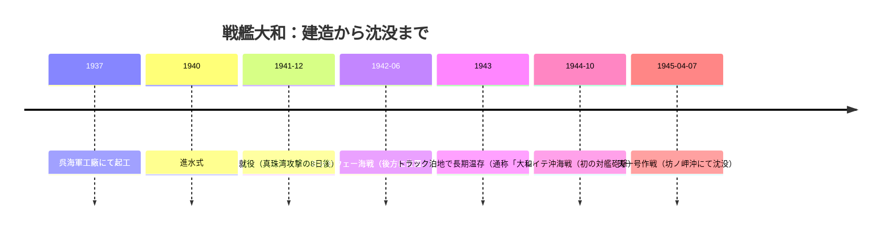

# ⚓ 戦艦大和から学ぶ戦艦時代の頂点と終焉

---

> 📌 **本ノートについて**
アヴローラ・ダンケルク・B-59・ビスマルク・ティルピッツ・シャルンホルスト・プリンス・オブ・ウェールズ・HMS Hood・USS Enterprise（CV-6）・赤城・ル・ファンタスク・SMS Emden・アドミラル・グラーフ・シュペー・USS New Jersey・ヴィットリオ・ヴェネト・HMS Dreadnought研究ノートと同じ標準フォーマットに従い、「艦艇を入口として歴史を学ぶ」設計思想で作成しています。スペック解説は最小限とし、**大日本帝国の国家戦略・ワシントン/ロンドン海軍軍縮条約・日本海軍の戦略思想・大艦巨砲主義・航空主兵への転換・レイテ沖海戦・天一号作戦**という歴史的・政治的・軍事戦略的テーマを重視しています。
> 

| 項目 | 内容 |
| --- | --- |
| 艦名 | 戦艦大和（やまと） |
| 艦種 | 大和型戦艦（一番艦） |
| 建造所 | 呉海軍工廠（広島県呉市） |
| 起工〜最期 | 1937年11月4日起工 → 1940年8月8日進水 → 1941年12月16日就役 → 1945年4月7日沈没（坊ノ岬沖海戦・天一号作戦） |
| 所属 | 大日本帝国海軍（連合艦隊） |
| 主な出来事 | 1942年 ミッドウェー海戦（連合艦隊旗艦として後方に位置）／1944年 レイテ沖海戦（サマール沖で主砲初の対艦発砲）／1945年 天一号作戦（沖縄水上特攻・坊ノ岬沖で撃沈） |
| 歴史的意義 | 46cm主砲9門・基準排水量64,000トンという史上最大の戦艦でありながら、その存在意義を発揮する機会をほとんど得られなかった。ワシントン・ロンドン軍縮条約体制の崩壊、大艦巨砲主義の極限、そして航空主兵への歴史的転換点を、その建造から沈没までの全生涯で体現した「戦艦という兵器思想そのものの墓標」 |

**本ノートの構成：**

1. 概要
2. 一言でいうと
3. なぜ有名なのか
4. 艦名の由来
5. 基本概要
6. 建造された時代背景（軍縮条約体制／日本海軍の戦略思想／大艦巨砲主義／日米海軍力の比較）
7. なぜ大和は建造されたのか
8. 艦歴
9. レイテ沖海戦
10. 天一号作戦
11. 関連する歴史事件
12. 関連人物
13. 歴史的評価
14. 論争点・誤解されやすい点
15. 現代への教訓
16. この艦から広がる歴史
17. 学習ルート
18. 動画ネタ案
19. 関連テーマ一覧
20. 時系列年表
21. 主要人物一覧
22. 日米戦略比較表
23. 日本海軍戦略解説
24. 歴史的因果関係の整理
25. 学習マップ

---

## 概要

戦艦**大和**（やまと）は、1941年（昭和16年）に大日本帝国海軍が就役させた戦艦である。基準排水量64,000トン、46cm三連装主砲3基9門を搭載し、人類が実戦配備した戦艦の中で最大・最強の火力を誇った。

しかし、この艦の歴史的意義は「世界最大」という記録にあるのではない。**なぜこれほどの巨艦が生まれ、なぜその力をほとんど発揮できないまま失われたのか**——この一点にこそ、大和という艦の本質がある。

大和は、ワシントン・ロンドン両海軍軍縮条約によって数的劣勢を強いられた日本海軍が、「質」で米英に対抗しようとした国家戦略の最終到達点として設計された。起工は条約体制からの離脱直後の1937年。日本が「無条約時代」に突入し、制約なき建艦競争へと足を踏み入れた、その象徴的な瞬間に大和は生まれた。

だが、大和が就役した1941年12月は、皮肉にも別の歴史的分岐点と重なっていた。その就役からわずか数日後、日本海軍自身がマレー沖海戦で英戦艦プリンス・オブ・ウェールズとレパルスを航空機のみで撃沈し、**戦艦の時代の終わりを自らの手で証明してしまった**のである。

大和はその後もほとんど実戦の機会を得られず、「大和ホテル」と皮肉られるほど温存され続けた。ようやく主砲を対艦目標に発射したのはレイテ沖海戦（1944年）が初めてであり、その最後は1945年4月、沖縄に向けた片道特攻——天一号作戦——での撃沈という悲劇的な結末を迎えた。

大和の生涯は、条約体制の崩壊、大艦巨砲主義という戦略思想の栄光と限界、航空主兵への不可逆的なパラダイムシフト、そして国家総力戦下の非合理な意思決定という、太平洋戦争の縮図そのものである。一隻の戦艦を通して、日本近代史の頂点と転落を同時に見ることができる。

---

## 一言でいうと

**「世界最大の力を持ちながら、その力を発揮する時代がすでに終わっていたことに気づけなかった、戦艦という兵器思想の墓標」**

---

## なぜ有名なのか

大和が有名なのは、戦果を挙げたからではない。大和はむしろ、**ほとんど戦わなかったこと自体が歴史的な意味を持つ艦**である。

**① 史上最大・最強の戦艦という記録**
基準排水量64,000トン、46cm主砲9門という数値は、人類が実戦配備した戦艦の中で今なお破られていない記録である。この巨大さ自体が、国民的な記憶と物語の源泉になった。

**② 国家予算を注ぎ込んだ「国家意思」の結晶**
建造費は当時の国家予算の相当割合を占め、その存在は太平洋戦争終結まで国民にはほぼ秘匿された。国家がひそかに全てを賭けた巨大プロジェクトという構図そのものが、後年の関心を集める要因となった。

**③ 「不沈艦神話」と「大艦巨砲主義の落日」という二重性**
建造時は「これさえあれば負けない」という自己暗示的な期待を背負いながら、就役後の戦争の主役はすでに航空機に移っていた。この期待と現実のギャップこそが、大和を語る上での中心的な緊張関係になっている。

**④ 天一号作戦という劇的な最期**
燃料もほとんど積めず、航空掩護も皆無のまま、片道分の燃料で沖縄へ向かわせた特攻作戦は、軍事合理性を超えた「組織の面子」「一億総特攻の先駆け」という情緒的論理によって決定された。この非合理性そのものが、戦後長く議論の対象になっている。

**⑤ 戦後の記憶とサブカルチャーでの消費**
大和は戦後、映画・アニメ・小説などで繰り返し「悲劇の英雄」として描かれてきた。この「敗北の象徴」が「ノスタルジーの象徴」へと変換されていく過程自体が、日本の戦争記憶のあり方を考える重要な材料になっている。

---

## 艦名の由来

「大和（やまと）」は、日本古代の律令国国名であり、また「大和民族」「大和魂」という言葉に象徴されるように、日本という国そのものを指す雅称でもある。

戦艦に国名・旧国名を冠する慣習は日本海軍の伝統であり、戦艦は基本的に旧国名（長門・陸奥・伊勢・日向・扶桑・山城など）から命名されていた。その中で「大和」は、単なる一地方名ではなく、日本という国家そのものを象徴する名でもあった。

一番艦にこの名が与えられたことは、単なる命名規則の帰結ではない。この艦が国家の威信と技術力の結晶として位置づけられていたことを、艦名そのものが雄弁に物語っている。「大和」という名を背負った戦艦が、日本の運命そのものと重なるように沈んでいったことは、後世の人々に強い象徴性を感じさせる要因ともなっている。

なお同型二番艦は「武蔵」（旧国名）、三番艦として空母に設計変更された艦は「信濃」（旧国名）と命名されており、いずれも国家的な重みを持つ地名が採用されている。

---

## 基本概要

| 項目 | 内容 |
| --- | --- |
| 基準排水量 | 約64,000トン（満載時約72,000トン） |
| 全長 | 263メートル |
| 最高速力 | 約27ノット |
| 主砲 | 46cm（18.1インチ）三連装砲塔 ×3基9門（史上最大口径） |
| 副砲・高角砲 | 15.5cm三連装砲、12.7cm連装高角砲、多数の25mm機銃（末期には対空機銃を大幅増設） |
| 装甲 | 舷側最大410mm、水平最大200mm超（当時世界最厚クラス） |
| 乗員数 | 約2,700〜3,332名（時期により変動） |
| 建造期間 | 起工1937年11月〜就役1941年12月（約4年） |
| 最終的な運命 | 1945年4月7日、坊ノ岬沖にて米軍機の攻撃により沈没 |

**スペックで注目すべき本質的な点：**

大和のスペックで真に重要なのは、数値の大きさそのものではなく、**「なぜこれほどの巨艦を、なぜ極秘裏に建造したのか」**という問いである。46cm砲という口径は、米海軍がパナマ運河の幅（約33メートル）に制約された戦艦しか通せないという地政学的弱点を見越し、それを凌駕する規模で設計された。つまり大和のスペックは、単なる技術的到達点ではなく、**条約体制下の弱者が編み出した「非対称な質的優越」の思想そのもの**を体現している。この設計思想を理解することが、以降の全ての章を読み解く鍵になる。

---

## 建造された時代背景

大和という一隻の戦艦を理解するには、まずその誕生を強いた国際政治の枠組み——軍縮条約体制——から出発しなければならない。

### 軍縮条約体制

**ワシントン海軍軍縮条約（1922年）**

第一次世界大戦後、英・米・日・仏・伊の五大国は、際限のない建艦競争が再び世界大戦を招くことを恐れ、1921〜22年にワシントン会議を開催した。ここで締結されたワシントン海軍軍縮条約は、主力艦（戦艦・巡洋戦艦）の保有比率を米5：英5：日3：仏1.67：伊1.67に制限した。

```
【ワシントン条約の主力艦保有比率】

アメリカ 5 ─┐
イギリス 5 ─┼─ 「5:5:3」体制
日本   3 ─┘
フランス 1.67
イタリア 1.67
```

日本にとってこの「対米英7割」という数字は、単なる制限以上の意味を持っていた。日本海軍は伝統的に「対米戦において互角以上に戦うには、少なくとも7割の兵力が必要」という「七割理論」を戦略計算の根拠にしていた。ワシントン条約はこの下限すれすれの比率を日本に押し付けるものであり、海軍内部では「国防の安全を脅かす屈辱的な条約」との受け止めが根強く残った。

一方で、当時の全権であった加藤友三郎海軍大将（後の首相）は、現実主義的な立場から条約受諾を主導した。加藤の認識——国家の総合的な国力（経済・工業・財政）を無視した軍拡は国防にならない——は、この時期の海軍指導層における最も重要な現実主義の系譜である。この加藤の路線を継承する海軍軍人・官僚は後に「条約派」と呼ばれることになる。

**ロンドン海軍軍縮条約（1930年）**

1930年のロンドン会議では、補助艦艇（巡洋艦・駆逐艦・潜水艦）にも保有制限が拡大された。日本は当初、重巡洋艦7割・潜水艦保有量の維持を要求したが、最終的には対米英ほぼ7割弱での妥結を余儀なくされた。

この条約批准をめぐり、日本国内では「**統帥権干犯問題**」という重大な政治的亀裂が生じた。海軍軍令部（作戦用兵の最高機関）の同意を得ないまま政府（浜口雄幸内閣）が条約に調印したことに対し、野党・右翼・海軍強硬派が「天皇の統帥権を政府が侵犯した」と激しく攻撃したのである。この論争は単なる軍事技術論争ではなく、**軍部が政党政治・内閣に優越する道を開く政治的武器**として機能した。浜口首相はこの直後に右翼青年に狙撃され、翌年死去している。

**条約体制からの離脱（1934〜1936年）**

1934年、日本は対米英同等比率（対等）を要求したが拒否され、条約体制からの離脱を通告した。1936年の第二次ロンドン軍縮会議には不参加のまま条約は失効し、世界は「**無条約時代**」に突入した。

大和の起工は、まさにこの無条約時代の幕開けである1937年に行われた。条約という「タガ」が外れたことで、日本海軍は初めて排水量・砲口径に制約されない戦艦を自由に設計できるようになった。大和とは、条約体制の崩壊がなければそもそも存在し得なかった艦なのである。

**条約派と艦隊派の暗闘**

条約受諾を推進した加藤友三郎らの現実主義的グループ（条約派）に対し、条約を「屈辱」とみなし対米英同等の兵力を求める強硬派（艦隊派、加藤寛治・末次信正らが代表格）が台頭した。1933年の「大角人事」と呼ばれる人事異動では、条約派の有力軍人が多数予備役に編入され、艦隊派が軍令部・海軍省の要職を掌握した。この権力構造の転換が、無条約時代における大艦巨砲路線の加速、ひいては大和型戦艦建造の政治的地ならしとなった。

| 条約名（年） | 主要内容 | 日本への影響 |
| --- | --- | --- |
| ワシントン条約（1922年） | 主力艦保有比率 米5:英5:日3 | 「対米7割」の屈辱感、条約派主導で受諾 |
| ロンドン条約（1930年） | 補助艦艇にも制限拡大 | 統帥権干犯問題が発生、政党政治への不信増大 |
| 条約離脱（1934〜36年） | 対等比率要求が拒否され離脱 | 無条約時代へ突入、大和型建造が本格化 |

### 日本海軍の戦略思想

日本海軍の戦略思想の根幹は、日露戦争（1904〜05年）の日本海海戦における圧倒的勝利の記憶にある。この成功体験は、「艦隊同士の一大決戦によって戦争の帰趨が決する」という**艦隊決戦思想**を、以後数十年にわたる海軍の教義として固定化させた。

この思想を実行プランに落とし込んだのが「**漸減邀撃作戦**」である。数的劣勢にある日本海軍が、太平洋を横断してくる米艦隊を迎え撃つにあたり、まず潜水艦・陸上攻撃機・水雷戦隊による波状攻撃で敵戦力を漸減させ、最終的に戦艦部隊による艦隊決戦で決着をつけるという構想だった。大和型戦艦は、この漸減邀撃作戦における「最終決戦兵力」の中核として設計された。

```
【漸減邀撃作戦の構想】

米艦隊、太平洋を西進
        ↓
①潜水艦による先制攻撃・消耗
        ↓
②陸上攻撃機・水雷戦隊による夜襲
        ↓
③敵戦力を「漸減」させた後
        ↓
④戦艦部隊（大和型中心）による艦隊決戦
        ↓
    勝利・講和
```

しかし、この構想には根本的な弱点があった。米艦隊が「思い通りに」西進してくることを前提としており、敵の行動を自ら選択できない受動的な戦略だったのである。実際の太平洋戦争において、米軍はアイランド・ホッピング（飛び石作戦）で日本の想定した決戦海域を迂回し、航空兵力によって日本の防衛線を各個撃破していった。漸減邀撃作戦は、その前提となる「敵が正面から来てくれる」というシナリオそのものが崩れたことで、実行される機会をほとんど持たないまま形骸化した。

### 大艦巨砲主義

「大艦巨砲主義」とは、より大きな艦体により大口径の砲を積むことが海軍力の優劣を決するという戦略思想である。日露戦争以来、世界の海軍はこの思想を共有していたが、日本海軍においては特に強い執着として残り続けた。

その背景には、工業力・資源で米英に劣る日本が、量的劣勢を質的優越で覆すしかないという構造的事情があった。「一隻あたりの戦闘力を極限まで高めれば、数の不利を覆せる」という発想は、条約下の対米7割という制約と表裏一体の関係にあり、大和型戦艦はその論理的な最終到達点として46cm砲・64,000トンという規模に到達した。

だがこの思想には自己矛盾があった。1機の航空機（建造・維持コストは戦艦とは比較にならないほど低い）が、巨大な戦艦を撃沈しうることを、日本海軍自身が真珠湾攻撃・マレー沖海戦で証明してしまったのである。皮肉なことに、大艦巨砲主義の頂点である大和が就役したまさにその直後に、大艦巨砲主義の終焉が同じ日本海軍の手によって告げられた。

### 日米海軍力の比較

条約体制下・無条約時代を通じて、日米の海軍力比較は日本の戦略的思考の出発点であり続けた。

| 項目 | 日本 | アメリカ |
| --- | --- | --- |
| ワシントン条約下の主力艦保有比率 | 3 | 5 |
| 工業生産力（造船能力の基盤） | 限定的（資源輸入依存） | 圧倒的（国内資源・生産基盤） |
| 石油・資源の自給 | ほぼ皆無（東南アジアに依存） | 世界最大級の産油国 |
| 基本戦略 | 漸減邀撃・艦隊決戦（受動的・迎撃型） | 戦争計画「オレンジ計画」に基づく太平洋横断・段階的進撃 |
| 大戦中の建艦ペース | 大和型2隻（大和・武蔵）に国家資源を集中 | エセックス級空母・アイオワ級戦艦を並行して大量建造 |
| 航空兵力への転換速度 | 戦艦優先の教義が根強く残存 | 空母機動部隊中心へ急速に転換 |

この比較が示す最大の非対称性は、**日本が一隻の「決戦兵器」に資源を集中したのに対し、アメリカは戦争全体を支える生産システムそのものを構築した**という点にある。大和型2隻分の鋼材・予算・熟練工があれば、護衛駆逐艦や航空機を大量に生産できたはずだった。日本海軍はこの「選択と集中」の代償を、シーレーン防衛の崩壊という形で戦争後半に払うことになる。

---

## なぜ大和は建造されたのか

大和建造の意思決定は、単一の理由ではなく、複数の要因が重なり合って生まれたものである。

**① 条約失効による設計自由度の解放**

1936年の無条約時代突入により、日本海軍は初めて排水量・砲口径の上限に縛られない戦艦を設計できるようになった。「今こそ質的優位を実現する好機」という機運が、大和型計画を後押しした。

**② パナマ運河という「敵の弱点」への着目**

米海軍の戦艦は、大西洋・太平洋を機動的に往来するためパナマ運河（全幅約33メートル）を通過できるサイズに制約されていた。日本はこの制約を前提に、運河を通過できない規模——すなわちアメリカが同等クラスの艦を太平洋に集中投入しにくい規模——の戦艦を設計することで、量的劣勢を覆そうとした。

**③ 「量で劣る者は質で勝つ」という組織的信念**

条約で対米7割に抑えられた日本海軍にとって、「一隻あたりの戦闘力で米戦艦を凌駕する」ことは、数的劣勢を埋め合わせる唯一の理論的解答だった。大和はこの信念の極限的な実装だった。

**④ 徹底した機密保持による「秘密兵器」化**

46cm砲の存在は建造中から敗戦まで国家最高機密として扱われ、海軍内部でも一部の関係者しか実態を知らなかった。「敵に知られていない圧倒的な質的優位」という発想自体が、条約時代を通じて培われた日本海軍の対抗戦略の集大成だった。

**⑤ 漸減邀撃作戦における「決戦兵力」としての位置づけ**

前章で見た漸減邀撃作戦の最終段階——戦艦部隊による艦隊決戦——を担う中核兵力として、大和型は構想された。この作戦ドクトリンが存在する限り、「最強の戦艦」という発想そのものが正当化され続けた。

これらの要因が示すのは、大和が単なる技術的到達点ではなく、**条約体制下で劣位に置かれた日本という国家の、非対称戦略の集大成**だったという事実である。しかし皮肉なことに、大和が実際に戦場に投入される頃には、漸減邀撃作戦の前提そのものが崩壊しており、この巨艦は自らが生まれるために想定された戦争のシナリオを一度も経験しないまま、まったく別の戦争——航空機とシーレーンをめぐる総力戦——の中に投げ込まれることになった。

---

## 艦歴

大和の艦歴を貫く最大の特徴は、**「その圧倒的な戦闘力にもかかわらず、決戦の機会をほとんど与えられなかった」**という一点にある。

**1937〜1941年：建造と就役**

1937年11月4日、呉海軍工廠にて起工。極秘裏に建造が進められ、周囲は目隠しで覆われ、工廠内でも一部の技術者しか全貌を知らなかった。1940年8月8日進水、1941年12月16日就役。真珠湾攻撃（1941年12月8日）のわずか8日後という、開戦直後のタイミングでの戦列入りだった。

**1942年：ミッドウェー海戦——後方に置かれた旗艦**

1942年6月、連合艦隊司令長官・山本五十六大将は大和に座乗し、ミッドウェー作戦を指揮した。しかし大和を含む主力部隊は、南雲機動部隊（空母4隻）のはるか後方に位置しており、電波封止（無線使用の制限）のため前線の危機的状況をリアルタイムで把握できなかった。日本海軍は空母4隻すべてを喪失する大敗を喫したが、大和自体は一度も交戦することなくこの海戦を終えた。

**1943〜1944年前半：トラック泊地での「大和ホテル」時代**

決戦兵力として温存する方針のもと、大和はトラック環礁に長期停泊を続けた。乗組員の間では、めったに出撃せず居住性だけは快適な巨艦を指して「大和ホテル」と自嘲的に呼ぶ空気が生まれたと伝えられる。この間、戦局は着実に悪化していった。

**1944年10月：レイテ沖海戦——初めての対艦砲撃**

第一遊撃部隊（栗田健男中将指揮）の旗艦としてレイテ沖海戦に参加。詳細は次章で扱うが、ここで大和は就役から3年近くを経て初めて主砲を対艦目標に発射した。

**1945年4月：天一号作戦——最期**

沖縄への水上特攻作戁「天一号作戦」に投入され、坊ノ岬沖にて米軍機の集中攻撃を受け撃沈。艦歴の詳細は後の章で扱う。

大和の艦歴を俯瞰すると、就役から沈没までの約3年4ヶ月のうち、実際に主砲を敵艦に向けて発射したのはレイテ沖海戦のわずか数十分間のみである。**「世界最強の戦艦」が、その存在理由を発揮する機会をほとんど持たないまま失われた**——これが大和の艦歴の本質である。



---

## レイテ沖海戦

1944年10月、米軍のフィリピン奪還作戦（レイテ島上陸）に対し、日本海軍は総力を挙げた「捷一号作戦」を発動した。この作戦の一環として、栗田健男中将率いる第一遊撃部隊（大和・武蔵を含む戦艦部隊）は、囮となった小沢艦隊（空母機動部隊）が米主力（ハルゼー艦隊）を北方へ引き寄せている隙に、レイテ湾へ突入し上陸部隊を叩くという構想の中核を担った。

**サマール沖海戦——初めての対艦砲撃**

10月25日未明、栗田艦隊はサンベルナルディノ海峡を突破し、レイテ湾を目前にしたサマール島沖で、米護衛空母部隊（通称「タフィ3」）と遭遇した。護衛空母は本来、上陸支援用の小型空母であり、戦艦部隊の敵ではないはずだった。大和はここで就役から約3年、ついに主砲を対艦目標に向けて発射した。

米側は駆逐艦・護衛駆逐艦による捨て身の魚雷突撃と、護衛空母艦載機による波状攻撃で応戦した。数の上では圧倒的に不利なはずの米側だったが、この激しい抵抗と煙幕により、栗田艦隊は状況を正確に把握できなくなっていった。

**「謎の反転」**

タフィ3を追い詰めレイテ湾突入を目前にした午前9時過ぎ、栗田艦隊は突如反転し、湾内突入を中止して退却した。この決断は「**謎の反転**」として、以後長く歴史家の間で議論の的となっている。

```
【栗田艦隊「謎の反転」をめぐる主要な解釈】

① 情報不足説
   → 北方の小沢囮艦隊が「成功」していたにもかかわらず、
     栗田はハルゼー主力が接近中と誤認していた

② 疲労・混乱説
   → 前日からの度重なる空襲と激戦で、指揮官・幕僚の
     判断力が限界に達していた

③ 心理的抵抗説
   → 上陸船団を叩く「輸送船攻撃」という任務に対し、
     「戦艦の華々しい決戦」を望む指揮官の心理的な
     抵抗があったのではないか

④ 合理的判断説
   → これ以上進めば燃料・弾薬が尽き、退路を断たれる
     リスクが高く、艦隊保全のための合理的撤退だった
```

いずれの説も決定的な証拠を欠いており、栗田本人も戦後多くを語らなかった。この「謎の反転」は、**戦場の霧（Fog of War）の中で下される指揮官の意思決定が、いかに不確実な情報と極限状態の心理に左右されるか**を示す事例として、軍事史上の重要な考察対象になっている。

**戦局への影響**

レイテ沖海戦全体は日本側の大敗に終わり、戦艦武蔵はこの海戦で撃沈された。大和は損傷を負いながらも生還したが、この海戦を最後に日本海軍の組織的な水上艦隊としての作戦能力は事実上失われた。大和が主砲を発射したのはこの一度きりであり、その後は二度と敵艦への砲撃機会を得ないまま、最後の特攻へと向かうことになる。

---

## 天一号作戦

1945年3月、米軍が沖縄本島への上陸を開始すると、連合艦隊は航空機による特攻作戦「菊水作戦」に加え、水上艦艇のみによる特攻作戦「**天一号作戦**」を発動した。

**作戦の内実**

大和を旗艦とする第二艦隊（第2艦隊司令長官・伊藤整一中将）は、軽巡洋艦矢矧・駆逐艦8隻とともに沖縄へ向け出撃することとなった。この作戦には、往路の燃料しか積まれておらず、事実上の片道特攻だった。作戦の名目上の目的は、沖縄に到達できれば大和を座礁させ「浮き砲台」として陸上戦を支援し、乗員を陸戦隊として上陸させるという構想であったが、座礁後に主砲を機能させるための条件（機関・電路・射撃管制の生存）はすでに現実的でないと軍令部内でも認識されていた。

より重要な実質的目的は、**沖縄へ向かう大和艦隊に米軍の戦闘機・攻撃機を引き寄せることで、並行して行われる航空特攻（菊水作戦）への迎撃を手薄にする**という、いわば「囮」としての役割だった。

**なぜ軍事合理性のない作戦が承認されたのか**

燃料不足、航空掩護皆無という条件下でのこの作戦には、純粋な軍事合理性はほとんど見出せない。それでも作戦が承認された背景には、「陸軍だけが沖縄で特攻し、海軍だけが無傷で残るわけにはいかない」という**組織の面子（メンツ）**、そして「一億総特攻の先駆けとなる」という情緒的・精神主義的な論理があったとされる。伊藤整一長官は当初この作戦の無謀さに強く反対したと伝えられるが、最終的には出撃を受諾した。

出撃前、伊藤は少しでも多くの将兵を救うため、海兵候補生や病人・老兵ら約30名の退艦を自らの判断で命じたと伝えられている。

**坊ノ岬沖海戦——最期**

1945年4月6日、大和以下10隻は徳山沖を出撃、豊後水道を抜けて沖縄へ南下した。翌4月7日正午過ぎ、米機動部隊の攻撃機約300機に捕捉され、集中的な空襲を受けた。

```
【4月7日 大和被弾経過（抜粋）】

12:41  後部に爆弾命中、電探室・主計課壊滅
12:45  左舷前部に魚雷1本命中
13:37  左舷中央部に魚雷3本命中、副舵故障
14:00  艦中央部に爆弾3発命中
14:07  右舷中央部に魚雷1本命中
14:12  左舷中部・後部に魚雷各1本命中、傾斜6度
14:17  左舷中部に魚雷1本命中、傾斜急増
14:20  傾斜20度、総員上甲板（総員退去）発令
14:23  大和、転覆・爆沈
```

魚雷約10本、爆弾多数の命中を受けた大和は、左舷に大きく傾斜した後に転覆し、主砲弾薬庫の誘爆によって船体は複数に分断され、坊ノ岬沖（鹿児島県沖）の海底に沈んだ。

乗組員約3,332名のうち、戦死者は約3,056名（諸資料では2,740名などの記載もある）、生存者は276名（一部資料では269名）にとどまった。伊藤整一司令長官は退艦を勧める幕僚に応じず、艦とともに海に消えたと伝えられている。有賀幸作艦長も操舵室の羅針儀を握ったまま艦と運命を共にしたとされる。

この作戦において米軍側の損害は軽微であり、天一号作戦は軍事的には何の戦果も上げられないまま、戦艦時代の終わりを象徴する悲劇として歴史に刻まれた。

---

## 関連する歴史事件

- **日露戦争・日本海海戦（1904〜1905年）:** 艦隊決戦思想の原点。この勝利体験が、以後数十年の日本海軍の教義を規定した。
- **ワシントン海軍軍縮条約（1922年）:** 対米英7割という制約が、日本海軍を「質的優越」路線へと駆り立てた出発点。
- **ロンドン海軍軍縮条約と統帥権干犯問題（1930年）:** 軍部が政党内閣に優越する政治的先例を作り、以後の軍拡路線を後押しした。
- **条約体制からの離脱（1934〜1936年）:** 無条約時代の到来により、大和型戦艦の自由な設計が可能になった。
- **真珠湾攻撃（1941年12月）とマレー沖海戦（1941年12月）:** 日本海軍自身が、航空機による戦艦撃沈を世界で初めて実証し、大艦巨砲主義の終焉を告げた。
- **ミッドウェー海戦（1942年6月）:** 空母4隻喪失という大敗が、日米の戦力バランスを決定的に逆転させた転換点。
- **ガダルカナル島の戦い（1942〜43年）:** 消耗戦の泥沼化により、日本の資源・生産基盤の限界が露呈した。
- **マリアナ沖海戦（1944年6月）:** 日本の航空兵力が壊滅的打撃を受け、以後の海戦での制空権喪失が決定的となった。
- **レイテ沖海戦（1944年10月）:** 大和が唯一主砲を対艦発射した海戦であり、日本海軍の組織的な水上作戦能力が事実上失われた海戦。
- **沖縄戦（1945年3〜6月）:** 天一号作戦の直接の背景となった、日本本土防衛の最終局面。

---

## 関連人物

| 人物 | 略歴・役割 | 大和との関連 |
| --- | --- | --- |
| **加藤友三郎** | 海軍大将・首相（1861-1923）。ワシントン軍縮会議の日本全権 | 「国防は国力なり」の現実主義路線を確立し、条約派の源流を作った |
| **山本五十六** | 連合艦隊司令長官（1884-1943）。航空兵力の重要性に早くから着目 | ミッドウェー海戦で大和に座乗し作戦を指揮、旗艦後方配置の是非が議論される |
| **伊藤整一** | 第二艦隊司令長官（1890-1945） | 天一号作戦で大和に乗艦し出撃を指揮、艦と運命を共にした |
| **有賀幸作** | 大和艦長（1897-1945） | 坊ノ岬沖海戦で艦と共に戦死したと伝えられる |
| **栗田健男** | 第一遊撃部隊司令官（1889-1977） | レイテ沖海戦で大和を含む艦隊を指揮、「謎の反転」で知られる |
| **末次信正／加藤寛治** | 艦隊派を代表する海軍軍人 | 条約強硬論・対米対等要求を主導し、無条約時代への流れを作った |
| **浜口雄幸** | 首相（1870-1931）。ロンドン条約締結時の内閣総理大臣 | 統帥権干犯問題で右翼から攻撃され、狙撃され翌年死去 |
| **松本喜太郎** | 大和型戦艦の主任設計者の一人 | 46cm砲搭載・パナマ運河対策を含む基本設計を統括 |

---

## 歴史的評価

戦艦大和は、日本海軍史上「最も矛盾を凝縮した艦」として評価されることが多い。

第一に、技術・工業力の到達点としての評価がある。46cm砲・64,000トンという規模を実現した設計・建造技術は、当時の日本の工業水準の高さを示すものであり、戦後の日本造船業の技術的基盤（ブロック工法・溶接技術など）にも連続性を持つとされる。

第二に、戦略思想としての評価は総じて厳しい。多くの研究者は、大和を「大艦巨砲主義という旧来の戦略思想に対する過剰投資の象徴」と位置づけている。歴史家エヴァンズとピーティー（『Kaigun』の著者）らは、日露戦争以来の艦隊決戦思想への固執が、航空主兵への転換を遅らせた組織的要因の一つだったと分析している。

第三に、資源配分という国家戦略の観点からの評価がある。大和型2隻に投じられた国家予算・鋼材・熟練労働力は、護衛艦艇や航空機の増産に転用すればシーレーン防衛の強化に資したはずであり、この「選択と集中」の是非は現在も議論が続いている。

一方で、大和を単純な「失敗の象徴」として断罪することにも慎重論がある。条約下の劣位という制約条件のもとで、当時の技術水準・戦略思想の枠内では、大和型のような質的優越路線は「合理的な選択」でもあった、という見方も根強い。歴史的評価は、後知恵（航空主兵への転換が正しかったという結果論）と、当時の意思決定者が置かれていた不確実性の中での判断とを、慎重に区別して論じる必要がある。

---

## 論争点・誤解されやすい点

- **「大和は無用の長物だった」という単純化への批判:** 結果論からは「大艦巨砲主義の失敗作」と評されがちだが、条約下の対米劣勢という制約の中では、質的優越路線自体は当時の海軍にとって理にかなった選択でもあった。単純な後知恵批判は、当時の意思決定の文脈を見落とす危険がある。
- **「日本海軍は航空機の重要性を理解していなかった」という誤解:** 山本五十六をはじめ、日本海軍は真珠湾攻撃・マレー沖海戦で世界に先駆けて航空機の有効性を証明した当事者である。むしろ「自らの成功体験を組織全体の教義転換に結びつけられなかった」という点にこそ問題の本質がある。
- **栗田艦隊の「謎の反転」の評価:** 「臆病な撤退」と断じる単純な物語は史料的に支持されにくい。情報不足・疲労・燃料状況など複数の要因が複合したと見るのが現在の研究の主流である。
- **天一号作戦の「特攻」という位置づけ:** 名目上は「浮き砲台」による陸上戦支援だったが、実態は燃料不足による事実上の片道作戦であり、純粋な軍事作戦というより組織の面子と精神主義が優越した意思決定だったという評価が一般的である。
- **「大和建造は議会の同意なき暴走」という誤解:** 実際には予算は帝国議会を通過しているが、真の内容（46cm砲搭載など）は architectural に偽装・秘匿されており、議会の実質的な統制機能は形骸化していた点が重要な論点である。

---

## 現代への教訓

大和の歴史が現代に示す教訓は、単なる「巨大兵器は無駄だった」という単純な結論にとどまらない。

第一に、**組織が自らの成功体験を教義転換に結びつけられないリスク**である。真珠湾攻撃・マレー沖海戦で航空機の有効性を証明した当の日本海軍が、なぜ戦艦中心の戦略から脱却できなかったのか——この問いは、現代の企業・軍事組織における「イノベーションのジレンマ」を考える上でも示唆的である。

第二に、**資源配分における「選択と集中」のリスク管理**である。一つの巨大プロジェクトに国家資源を集中させることの是非は、現代の巨大公共事業・防衛調達・先端技術開発においても常に問われる論点である。

第三に、**組織の面子・情緒的論理が軍事的合理性を凌駕するメカニズム**である。天一号作戦に見られるように、「他の部門だけが犠牲を払うわけにはいかない」という組織内の心理は、現代の組織的意思決定においても繰り返し観察される病理であり、大和の最期はその極端な事例として記憶されるべきだろう。

---

## この艦から広がる歴史

戦艦大和を入口とすることで、次のような歴史的テーマへと視野を広げることができる。

- **軍縮条約の政治学:** ワシントン・ロンドン両条約から、国際的な軍備管理の歴史、そして条約体制崩壊が戦争への道を準備するメカニズムを学べる。
- **組織論としての日本海軍:** 条約派と艦隊派の対立、統帥権干犯問題は、軍事組織における政治と専門性、そして文民統制の危うさを考察する材料になる。
- **軍事におけるパラダイムシフト:** 大艦巨砲主義から航空主兵への転換は、「軍事における革命（RMA）」への組織的抵抗という、現代にも通じる普遍的なテーマにつながる。
- **戦争の記憶とパブリック・ヒストリー:** 大和が戦後どのように「悲劇の英雄」として消費されてきたかは、国家の敗北をどう記憶し継承するかという、戦後日本のナショナリズム論にも接続する。

---

## 学習ルート

1. まず「ワシントン海軍軍縮条約」「ロンドン海軍軍縮条約」で国際的な軍備管理の枠組みを理解する。
2. 次に「統帥権干犯問題」「条約派と艦隊派」で日本国内の政治的対立構造を学ぶ。
3. 「大艦巨砲主義」と「マハンのシーパワー論」（HMS Dreadnought研究ノート参照）を対比させ、戦艦という兵器思想の系譜をたどる。
4. 「真珠湾攻撃」「マレー沖海戦」（プリンス・オブ・ウェールズ研究ノート参照）で航空主兵への転換点を確認する。
5. 「ミッドウェー海戦」「レイテ沖海戦」で艦隊決戦思想の実際の帰結を追う。
6. 最後に「天一号作戦」で、組織の非合理な意思決定メカニズムという普遍的テーマに到達する。

---

## 動画ネタ案

| 優先度 | タイトル案 | 内容概要 |
| --- | --- | --- |
| ★★★ | **「世界最大の戦艦はなぜ活躍できなかったのか——大和の3年4ヶ月」** | 就役から沈没までの艦歴を辿り、「実戦機会がほとんどなかった」という事実そのものを軸に、期待と現実のギャップを解説。現代の高額兵器調達論とも接続 |
| ★★★ | **「対米7割の屈辱——ワシントン条約が生んだ日本海軍の執念」** | ワシントン・ロンドン両条約と統帥権干犯問題を軸に、条約が日本の軍拡路線をどう規定したかを解説。国際交渉と国内政治の連動を描く |
| ★★★ | **「自分で自分の時代を終わらせた海軍——マレー沖海戦の皮肉」** | 日本海軍が航空機で戦艦を沈められることを世界で最初に証明したにもかかわらず、大艦巨砲主義から脱却できなかった自己矛盾を解説 |
| ★★★ | **「なぜ栗田艦隊は反転したのか——レイテ沖海戦『謎の反転』」** | サマール沖海戦の激戦から反転までを時系列で再現し、複数の解釈を提示。指揮官の意思決定と「戦場の霧」を考察 |
| ★★ | **「片道切符の特攻——天一号作戦はなぜ止められなかったのか」** | 軍事合理性のない作戦がなぜ承認されたのかを、組織の面子・精神主義という観点から解説。現代組織論への接続 |
| ★★ | **「大和ホテル——決戦兵力はなぜ温存され続けたのか」」** | トラック泊地での長期温存生活を軸に、「艦隊保存（Fleet in Being）」というドクトリンの是非を問う |
| ★★ | **「46cm砲の秘密——パナマ運河を見越した設計思想」** | 大和の巨大さの背景にある地政学的計算を解説。「敵の制約を利用する」設計思想の是非を論じる |
| ★ | **「大和の技術は戦後にどう受け継がれたか——造船大国ニッポンの原点」** | 建造技術（ブロック工法・溶接技術）が戦後の造船業に与えた連続性を解説 |

---

## 関連テーマ一覧

### 🌊 海戦・軍事作戦

- 日本海海戦（1905年）——艦隊決戦思想の原点
- 真珠湾攻撃（1941年）
- マレー沖海戦（1941年）——戦艦時代終焉の予告
- ミッドウェー海戦（1942年）
- ガダルカナル島の戦い（1942〜43年）
- マリアナ沖海戦（1944年）
- レイテ沖海戦（1944年）
- 天一号作戦・坊ノ岬沖海戦（1945年）
- 沖縄戦（1945年）

### 🏛 政治・外交・国際関係

- ワシントン海軍軍縮条約（1922年）
- ロンドン海軍軍縮条約（1930年）
- 統帥権干犯問題
- 条約派と艦隊派の対立
- 大日本帝国の国家総力戦体制

### ⚙️ 技術・軍事思想

- 大艦巨砲主義
- 漸減邀撃作戦
- 艦隊保存（Fleet in Being）ドクトリン
- 航空主兵への転換
- 軍事における革命（RMA）と組織の抵抗

### 🔭 現代への接続

- 巨大兵器プロジェクトの費用対効果論争
- 組織的意思決定における非合理性（サンクコスト・面子）
- 戦争の記憶とナショナリズム・サブカルチャー
- 技術覇権競争と軍拡のジレンマ

---

## 時系列年表

| 年 | 出来事 |
| --- | --- |
| 1904-05年 | 日露戦争・日本海海戦——艦隊決戦思想が日本海軍の教義として定着 |
| 1921-22年 | ワシントン会議・ワシントン海軍軍縮条約締結（米5:英5:日3） |
| 1923年 | 加藤友三郎、首相在任中に死去 |
| 1930年 | ロンドン海軍軍縮条約締結——統帥権干犯問題が勃発 |
| 1931年 | 浜口雄幸、狙撃事件の傷がもとで死去 |
| 1933年 | 「大角人事」——条約派が退けられ艦隊派が海軍の要職を掌握 |
| 1934年 | 日本、対米英対等比率を要求するも拒否され条約脱退を通告 |
| 1936年 | 第二次ロンドン軍縮会議に日本不参加——無条約時代へ突入 |
| 1937年11月4日 | 呉海軍工廠にて戦艦大和 起工 |
| 1940年8月8日 | 戦艦大和 進水 |
| 1941年12月8日 | 真珠湾攻撃・マレー作戦開始 |
| 1941年12月10日 | マレー沖海戦——英戦艦プリンス・オブ・ウェールズ／レパルスを航空機のみで撃沈 |
| 1941年12月16日 | 戦艦大和 就役 |
| 1942年6月 | ミッドウェー海戦——大和は後方に位置し無交戦、日本空母4隻喪失 |
| 1942年8月〜1943年2月 | ガダルカナル島の戦い——消耗戦により戦局悪化 |
| 1943年〜1944年前半 | 大和、トラック泊地に長期停泊（「大和ホテル」） |
| 1944年6月 | マリアナ沖海戦——日本航空兵力が壊滅的打撃を受ける |
| 1944年10月23-26日 | レイテ沖海戦——大和、サマール沖で初の対艦砲撃／栗田艦隊「謎の反転」 |
| 1945年3月 | 米軍、沖縄本島への上陸作戦開始 |
| 1945年4月6日 | 天一号作戦発動、大和以下10隻が沖縄へ向け出撃 |
| 1945年4月7日 | 坊ノ岬沖海戦——米軍機の集中攻撃を受け大和沈没 |
| 1945年6月 | 沖縄戦終結 |
| 1945年8月 | 日本、ポツダム宣言受諾・終戦 |
| 1985年 | 大和の船体、坊ノ岬沖の海底で発見される |
| 2005年 | 大和ミュージアム（呉市海事歴史科学館）開館 |

---

## 主要人物一覧

| 人物名 | 生没年 | 役割 | 関連ポイント |
| --- | --- | --- | --- |
| 加藤友三郎 | 1861-1923 | 海軍大将・首相、ワシントン会議全権 | 「国防は国力なり」の現実主義路線、条約派の源流 |
| 浜口雄幸 | 1870-1931 | 首相、ロンドン条約締結 | 統帥権干犯問題で攻撃され狙撃、翌年死去 |
| 加藤寛治 | 1870-1939 | 軍令部長、艦隊派の代表格 | ロンドン条約に反対、対米対等要求を主導 |
| 末次信正 | 1880-1944 | 艦隊派の中心人物 | 大艦巨砲・対米強硬路線を推進 |
| 山本五十六 | 1884-1943 | 連合艦隊司令長官 | 航空兵力の重要性に着目しつつ、大和で作戦指揮も担当 |
| 伊藤整一 | 1890-1945 | 第二艦隊司令長官 | 天一号作戦で大和に乗艦、艦と運命を共にした |
| 有賀幸作 | 1897-1945 | 大和艦長 | 坊ノ岬沖海戦で艦と共に戦死 |
| 栗田健男 | 1889-1977 | 第一遊撃部隊司令官 | レイテ沖海戦「謎の反転」で知られる |
| 松本喜太郎 | ― | 大和型主任設計者の一人 | 46cm砲搭載・巨大船体の基本設計を統括 |

---

## 日米戦略比較表

| 観点 | 日本 | アメリカ |
| --- | --- | --- |
| 基本戦略思想 | 艦隊決戦・漸減邀撃（受動的迎撃型） | 段階的進撃・オレンジ計画（能動的攻勢型） |
| 資源配分の考え方 | 少数の巨大兵器に質的優位を集中 | 生産システム全体を大量建造で圧倒 |
| 軍縮条約への対応 | 対米7割を「屈辱」と捉え離脱へ | 条約遵守しつつ工業基盤で優位確保 |
| 航空兵力への転換 | ドクトリン転換が遅れ戦艦偏重が継続 | 空母機動部隊中心へ急速に転換 |
| シーレーン防衛 | 軽視され通商破壊への対策が手薄 | 護衛体制・対潜戦術を体系的に整備 |
| 意思決定プロセス | 軍令部と海軍省の対立、統帥権の政治利用 | 文民統制のもとでの一元的な戦争指導 |

---

## 日本海軍戦略解説

大和の戦略的背景を理解するうえで鍵となるのが、**「量的劣位を質的優位で覆す」という発想の系譜**である。

```
【日本海軍の基本戦略ロジック】

工業力・資源で米英に劣る
        ↓
条約により保有量も制限される（対米7割）
        ↓
「量で勝てないなら質で勝つ」という結論
        ↓
①大艦巨砲主義（大和型戦艦）
②高性能な水雷戦隊・夜戦技術
③漸減邀撃作戦という受動的迎撃ドクトリン
        ↓
前提：「敵が想定通りの海域・タイミングで来る」
        ↓
現実：米軍はアイランド・ホッピングで想定を回避
        ↓
質的優位の思想が「実行される場」を失う
```

この図式が示す通り、日本海軍の戦略思想は「相手が特定の行動を取ること」を前提にした受動的な性格を強く持っていた。航空主兵への転換が遅れた背景にも、この「決戦」という一点に賭ける発想からの脱却が組織的に困難だったという事情が横たわっている。

---

## 歴史的因果関係の整理

```
【大和を軸とした歴史的因果連鎖】

① 1905年——日本海海戦の勝利
    艦隊決戦思想が海軍の教義として固定化
        ↓

② 1922年——ワシントン海軍軍縮条約
    対米7割という制約、「質で数を覆す」思想の起点
        ↓

③ 1930年——ロンドン海軍軍縮条約と統帥権干犯問題
    軍部が政党政治に優越する政治的先例が生まれる
        ↓

④ 1933-36年——条約派の排除と条約体制からの離脱
    無条約時代の到来、大艦巨砲路線が政治的に加速
        ↓

⑤ 1937-41年——大和建造
    質的優位思想の極限的な実装、国家機密として秘匿
        ↓

⑥ 1941年12月——真珠湾攻撃・マレー沖海戦
    日本自身が航空機による戦艦撃沈を証明
    →大艦巨砲主義の理論的根拠が自ら崩れる
        ↓

⑦ 1942年——ミッドウェー海戦
    空母兵力の喪失により漸減邀撃作戦の前提が崩壊
        ↓

⑧ 1944年——レイテ沖海戦
    大和、唯一の対艦砲撃も戦局を覆せず
    水上艦隊の組織的作戦能力が事実上消滅
        ↓

⑨ 1945年——天一号作戦
    軍事合理性なき特攻、組織の面子が戦略を凌駕
        ↓

⑩ 大和沈没——戦艦時代の終焉
    航空機・空母中心の戦争へ完全移行
        ↓

⑪ 戦後——記憶の消費とテクノ・ナショナリズム
    大和は「悲劇の英雄」として繰り返し語り継がれる
```

---

## 学習マップ

```
【戦艦大和を核とした学習マップ】

           日露戦争・日本海海戦（1905年）
              「艦隊決戦思想」の原点
                      ↓

    ワシントン軍縮条約 ←── 対米7割 ──→ 「質で数を覆す」思想
         ↓                                    ↓
  加藤友三郎の現実主義              大艦巨砲主義への傾斜
    （条約派の源流）                          ↓
         ↓                          ロンドン軍縮条約・
    条約派 vs 艦隊派 ←──────────  統帥権干犯問題
         ↓
    艦隊派の勝利（大角人事）
         ↓
    条約体制からの離脱（無条約時代）
         ↓
━━━━━━━━━━━━━━━━━━━━━━━━
         戦艦大和 建造（1937-1941年）
   「46cm砲×パナマ運河対策×国家機密」
━━━━━━━━━━━━━━━━━━━━━━━━
      ↙              ↓              ↘
真珠湾攻撃・      ミッドウェー海戦    漸減邀撃作戦の
マレー沖海戦      （空母喪失・        前提崩壊
（自己矛盾の露呈）  漸減邀撃の破綻）
      ↓              ↓              ↓
      ↘              ↓             ↙
          レイテ沖海戦（1944年）
       大和、唯一の対艦砲撃／謎の反転
                      ↓
          天一号作戦（1945年4月）
       組織の面子が軍事合理性を凌駕
                      ↓
              坊ノ岬沖にて大和沈没
              戦艦時代の終焉
                      ↓
        ↙                          ↘
  戦後の技術的連続性            戦争の記憶の消費
  （造船業・工業技術）          （悲劇の英雄化・サブカルチャー）
                      ↓
              現代への教訓
    ・成功体験と組織的教義転換の失敗
    ・巨大プロジェクトへの資源集中のリスク
    ・組織の面子が合理性を凌駕するメカニズム
```

---

